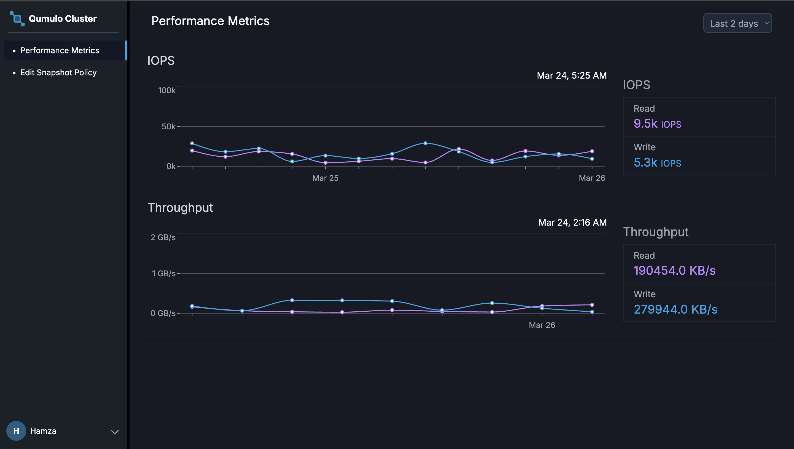
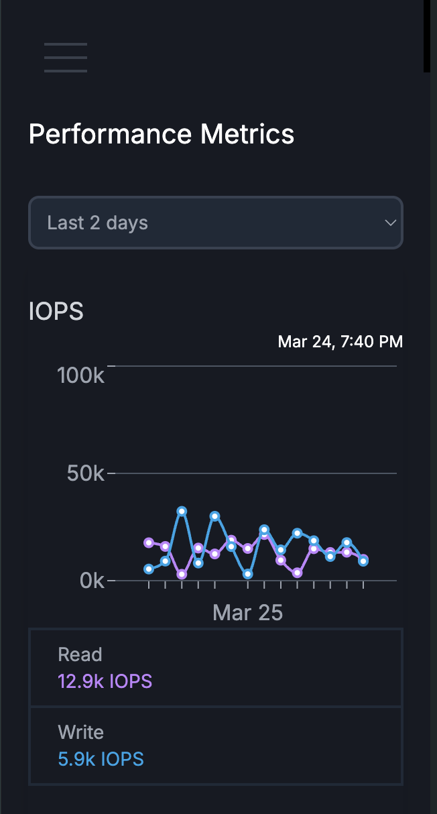
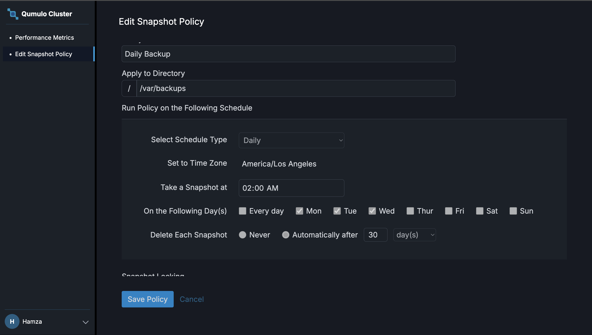
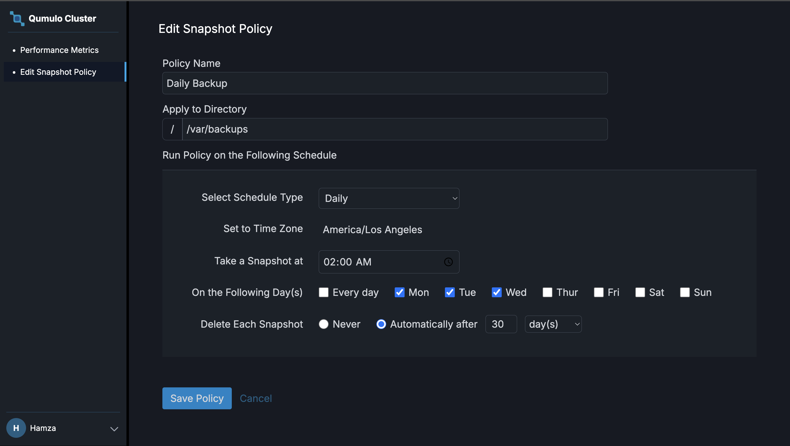
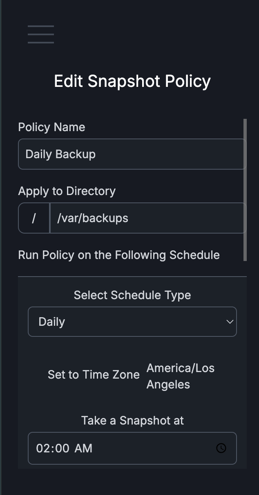
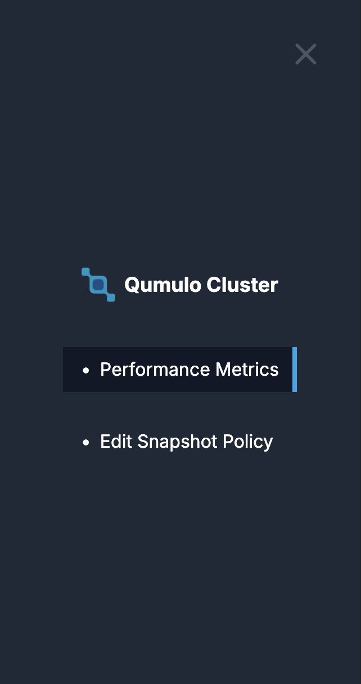

# Cluster Monitoring & Snapshot Management Application

This project showcases UI and API development expertise using React, TypeScript, Next.js, and AdonisJS. It enables cluster monitoring by visualizing time series metrics like IOPS and Throughput while managing snapshot policy configurations. The frontend, built with Next.js, leverages Recharts for data visualization and TailwindCSS for styling, while the backend API is powered by AdonisJS.

Here is the loom video to demonstrate the UI features.
https://www.loom.com/share/ed77c22ce395429b969c8914c5fe88c9

## Features

### Frontend

- **Cluster Dashboard**:

  - A responsive UI to monitor clusters with time series graphs for IOPS and Throughput metrics.
  - Data filtering by time periods (e.g., last 2, 4, or 6 days).
  - Built with `Next.js`, `Recharts`, and `TailwindCSS`.

- **Snapshot Policy Form**:
  - UI to configure snapshot policies, including schedule type (daily/weekly), snapshot locking, and retention policies.
  - Snapshot locking is disabled when the "Never" delete policy is selected.
  - Integration with backend APIs using Axios.

### Backend

- **API Endpoints**:
  - `GET /clusters/:id`: Retrieve time series data (IOPS and Throughput) for a cluster.
  - `GET /clusters/:id/snapshot-policy`: Fetch the snapshot policy configuration for a cluster.
  - `PATCH /clusters/:id/snapshot-policy`: Update the snapshot policy configuration.

### Assumptions

- Backend data is stored in a database(Mongo DB).
- At least one day should be selected in the snapshot policy schedule if "Every Day" is not checked.
- The frontend handles both IOPS and Throughput metrics and displays snapshot configurations.

### Potential Improvements

- Add unit tests for frontend components.
- Implement state management with `Redux` or similar tools.
- Use WebSockets for real-time data streaming in time series graphs.

## Local Setup Guidelines

### Prerequisites

- Node.js (>= 18.x)
- AdonisJS CLI installed globally (`npm i -g @adonisjs/cli`)

### Clone the Repository

```bash
git clone https://github.com/hamzashakeel348/cluster-monitoring-app.git
cd cluster-monitoring-app
```

### Navigate to the frontend directory:

```bash
cd frontend
```

### Install dependencies:

```bash
npm install
```

### Create an .env file based on the example:

```bash
cp .env.example .env
```

### Add your environment variables in .env:
#### You need to add id of your created Cluster.
```bash
NEXT_PUBLIC_API_BASE_URL=http://127.0.0.1:3333
NEXT_PUBLIC_CLUSTER_ID=
```

### Run the development server:

```bash
npm run dev
```

### Open the application in your browser:

```bash
http://localhost:3000
```

## Backend Setup

### Navigate to the backend directory:

```bash
cd backend
```

### Install dependencies:

```bash
npm install
```


### In cases you want to populate DB, I added seeder:
#### Run this command in the root of backend directory
```bash
ts-node seed.ts   
```

### Create an .env file based on the example:

```bash
cp .env.example .env
```

### Add your environment variables in .env:
#### You can also pick them from the .env.example
```bash
PORT=3333
HOST=
NODE_ENV=
APP_KEY=
DRIVE_DISK=
DB_CONNECTION=
MONGO_URI=
```

### Run the development server:

```bash
npm run dev
```

### The backend API will be available at:

```bash
http://127.0.0.1:3333
```

## API Documentation

### Endpoints

- **GET Time Series Data:**

  - `GET /clusters/:id`
  - Response: Time series data for IOPS, Throughput.
  - Example Response:
    ```json
    {
      "_id": "uuid-of-cluster",
      "name": "name-of-cluster",
      "timeSeries": {
        "IOPS": [
          { "timestamp": 2025-03-26T08:29:00.364+00:00, "read": 150, "write": 150 },
          { "timestamp": 2025-03-26T08:29:00.364+00:00, "read": 150, "write": 150 }
        ],
        "Throughput": [
          { "timestamp": 2025-03-26T08:29:00.364+00:00, "read": 150, "write": 150 },
          { "timestamp": 2025-03-26T08:29:00.364+00:00, "read": 150, "write": 150 }
        ]
      }
    }
    ```

- **GET Snapshot Policy:**

  - `GET /clusters/:id/snapshot-policy`
  - Response: Snapshot policy configuration for the cluster.
  - Example Response:
    ```json
    {
      "_id": "uuid-of-snapshotPolicy",
      "clusterId": "uuid-of-cluster",
      "policyName": "Weekly Backup",
      "directoryPath": "/backups/weekly",
      "schedule": {
        "type": "weekly",
        "snapshotTime": "07:00 AM",
        "days": ["Mon", "Tue"]
      },
      "deletePolicy": {
        "type": "never",
        "after": 30,
        "cadence": "days"
      },
      "snapshotLocking": true,
      "enablePolicy": true
    }
    ```

- **Update Snapshot Policy:**
  - `Patch /clusters/:id/snapshot-policy`
  - Request Body: JSON body with the updated policy configuration.
  - Example Request Body:
    ```json
    {
      "snapshotPolicy": {
        "schedule": "weekly",
        "enablePolicy": false
      }
    }
    ```
  - Example Response(Updated Data):
    ```json
    {
      "_id": "uuid-of-snapshotPolicy",
      "clusterId": "uuid-of-cluster",
      "policyName": "Daily Backup",
      "directoryPath": "/backups/daily",
      "schedule": {
        "type": "weekly",
        "snapshotTime": "07:00 AM",
        "days": ["Mon", "Tue"]
      },
      "deletePolicy": {
        "type": "never",
        "after": 30,
        "cadence": "days"
      },
      "snapshotLocking": true,
      "enablePolicy": false
    }
    ```

### Backend Tests

To run the test suite for the backend application:

1.  Navigate to the backend directory:
    ```bash
    cd backend
    ```
2.  Run the following command:
    variables in .env:

    ```bash
    npm run test
    ```

## Deployment Dependencies

### Environment Variables

Ensure that the following environment variables are defined in the .env file for both the frontend and backend:

- Backend .env file:

```bash
PORT=3333
HOST=
NODE_ENV=
APP_KEY=
DRIVE_DISK=
DB_CONNECTION=
MONGO_URI=
```

- Frontend .env file:

```bash
NEXT_PUBLIC_API_BASE_URL=http://127.0.0.1:3333
NEXT_PUBLIC_CLUSTER_ID=
```

## Snapshots

### Cluster Timeseries Graph





### Snaphot Policy For Cluster
#### Locked


#### UnLocked




### Mobile Navbar


